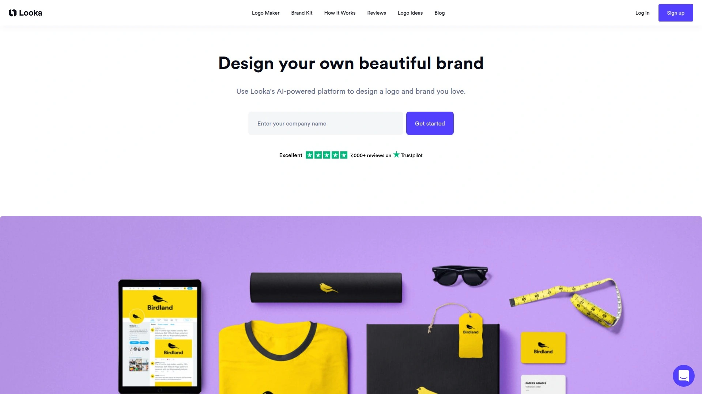

# 2025年十七大最佳AI标志设计工具

创业或者做品牌升级,第一件头疼的事就是logo设计。找设计师动辄几千块起步,自己不会PS又折腾不出来,在线模板网站千篇一律没有辨识度。现在AI标志生成器把这件事变简单了,输入品牌名和行业,几分钟就能拿到几十个原创设计方案,还能无限调整颜色、字体、图标直到满意为止。这些工具不仅生成速度快,输出的文件格式也全,PNG、SVG、PDF都有,印名片做网站都能直接用。下面整理了17个靠谱的平台,从完全免费到功能强大的付费版都有,总能找到适合你的那一款。

***

## **[Logome.ai](https://www.logome.ai)**

AI驱动的全能品牌设计平台,不只是做logo

Logome最大的特点是它不走模板路线,而是真正用AI根据你的行业、风格偏好和颜色选择生成独一无二的设计。你不会看到和别家公司一模一样的logo,因为每次生成都是算法实时创作的。

**核心功能覆盖全**:除了AI标志生成器,还有完整的品牌套件工具,包括电子邮件签名、名片、网站模板、社交媒体封面和海报。网站模板是100%响应式的,手机和平板都能完美显示。提供100多种字体和纯色/渐变配色方案任你选。

操作流程分四步:输入企业名称和行业→选择风格、颜色和图标→用编辑器微调字体颜色布局→下载PNG、SVG、PDF、EPS多种格式。界面设计得特别直观,完全不需要设计经验或者AI知识就能上手。

最让人放心的是可以保存喜欢的设计稍后再调整,或者发给团队征求意见。图标库非常丰富,能找到几乎所有行业的代表性符号。用户体验比那些传统设计软件友好太多了。

---

## **[Looka](https://looka.com)**

5分钟出成品,综合品牌包最完整

Looka在AI logo生成领域算是老牌了,最大优势是生成速度快且设计质量高。测试时给虚构咖啡馆Cafiora生成的方案都很有质感,不像随机拼凑出来的。

**设计流程**:输入企业名称→选择喜欢的颜色和风格→添加标语(可选)→选择代表品牌的图标,系统就会生成多个logo方案供你挑选。不需要注册就能生成和定制logo,只有下载时才要创建账号。

提供的不只是logo文件,付费版包括高分辨率PNG/JPG、可缩放的SVG和EPS矢量文件、多种配色变体、品牌指南和真实场景样机预览。样机功能特别实用,能看到logo印在名片、T恤、店面招牌上的实际效果。

编辑器可以调整logo让它更大胆、俏皮或极简,风格切换很灵活。还有一页资源展示你logo的专用字体和颜色代码,方便后续设计保持统一。

***

## **[Canva AI Logo Generator](https://www.canva.com/ai-logo-generator/)**

Dream Lab加持,每月免费20次生成额度

Canva把Leonardo.AI的Dream Lab技术整合进来做logo生成器,输入文本提示就能得到专业级设计。免费账户每月有20次提示额度,Pro用户能用500次。

**风格多样性强**:支持3D渲染、图形设计矢量、插图、素描(黑白)、素描(彩色)等多种生成风格。还能上传参考图让AI按照同样风格和主题生成logo,保证品牌一致性。

AI提示系统设计得很人性化,用自然语言描述就行,不需要学专业术语。从简单文字到惊艳图像的转化过程非常快,几秒钟就能看到结果。

最大的好处是和Canva生态系统无缝衔接,生成的logo可以直接用在Canva里设计的传单、名片、社交媒体帖子上。网页版和移动端都能访问,随时随地改设计。

***

## **[Tailor Brands](https://www.tailorbrands.com)**

不只做logo,还能帮你注册公司

Tailor Brands的定位比单纯logo工具更广,做完设计能直接跳转到LLC公司注册页面。logo生成流程也是分步引导:输入公司名和业务类型→选择logo样式(文字标志、字母组合或图标)→挑选喜欢的字体→等待不到1分钟→从生成的方案里选一个定制。

**三种logo类型**可选很贴心:文字型适合品牌名本身就有辨识度的公司,字母组合型适合名字太长的,图标型适合需要视觉符号的。最终下载的文件包括矢量EPS、SVG和PNG格式,覆盖所有使用场景。

AI会提前学习你的业务信息和设计偏好,所以生成的方案不是随机的,而是真正适合你品牌的。编辑器支持调字体样式、配色、图标,还能移动元素位置。

品牌调性比较现代商务,适合创业公司和专业人士。博客里还有很多logo设计教程和品牌建设文章,新手可以学不少东西。

***

## **[Designhill AI Logo Maker](https://www.designhill.com/tools/logo-maker)**

免费生成无限次,模板库超大

Designhill的logo制作工具用了AI和机器学习算法,每次用户使用它都会变得更聪明。系统能理解用户偏好和输入,结合过去类似用户的选择创作高质量logo。

**素材资源惊人**:数万个图标、1万多种配色组合、2000多种超高清字体、5000多种形状和容器。这个组合数量能保证你的logo和别人撞款的概率极低。

操作步骤很简单:访问Designhill网站进入logo工具→输入公司名→从已有logo里挑至少5个喜欢的风格让系统理解你的偏好→选颜色(也可以跳过这步后面再改)→系统生成几十个专属logo供你选。

对系统配置要求不高,1-2GB内存就能流畅运行,支持几乎所有操作系统。完全免费使用,不需要信用卡,适合预算紧张的初创企业。

***

## **[LogoAI](https://www.logoai.com)**

品牌一致性AI,自动生成配套设计

LogoAI不仅生成logo,还会基于你的logo自动创建一整套品牌资产。一旦确定了logo设计,AI会用同样的配色和风格自动生成名片、社交媒体模板、信纸等。

生成器采用先进的机器学习模型,分析你输入的品牌名、行业和风格偏好,在几秒内产出多个专业级logo选项。和一些工具只给你10-20个方案不同,LogoAI能生成上百个变体供你筛选。

**定制灵活度高**:每个元素都能单独调整,包括字体大小粗细、图标位置旋转、颜色深浅、布局结构。如果你有特定的品牌色,可以精确输入色值代码。

下载的品牌套件包含所有格式和尺寸的logo文件,省去后期再找设计师做延展的麻烦。适合需要快速建立完整品牌形象的电商卖家和SaaS公司。

***

## **[Brandmark](https://brandmark.io)**

最先进的AI算法,极简风格专家

Brandmark被称为"最先进的AI logo设计工具",它的算法特别擅长创造极简现代风格的logo。和Looka相比,Brandmark生成的设计更偏向简约主义,如果你喜欢复杂华丽的可能要看别的。

**操作超简单**:输入品牌名和可选标语→选几个和行业相关的关键词→挑配色风格→左右滑动查看更多生成方案。如果不满意可以回去调关键词或换配色重新生成。

工具会瞬间生成数千个logo变体,用AI分析你的品牌数据找到最合适的。编辑器能自由调整字体、颜色和图标,让logo更贴合品牌形象。

**价格实惠**:最便宜的logo套餐只要25美元。还提供免费试用版让你测试功能再决定是否购买。除了logo,还有社交媒体头图、名片、信纸样机等品牌工具。

***

## **[Namecheap Free Logo Maker](https://www.namecheap.com/logo-maker/)**

域名商做的免费工具,真正0成本

Namecheap本来是做域名注册和主机托管的,他们的logo制作器完全免费,不需要信用卡也不要求注册账号就能使用。对小企业主和创业者特别友好。

**AI启动向导**设计得很贴心,一步步引导你完成设计,即使是完全没经验的新手也能快速上手。工具会问几个关于你品牌的简单问题,根据回答提出logo建议。

覆盖120多种行业的设计模板,从零售科技到创意服务、房地产都有。可以自由调整颜色、字体、图标和布局,虽然没有付费软件那么多高级功能,但基本创意控制权还是给足的。

下载格式包括PNG和SVG矢量文件,PNG适合网站社交媒体,SVG能无限缩放不失真,印大幅海报名片都行。作为Namecheap Visual套件的一部分,还有字体制作器、网站制作器等其他创意工具。

***

## **[Wix Logo Maker](https://www.wix.com/blog/wix-logo-generator-best-way-to-create-your-own-logo)**

AI聊天式设计,自带创业辅导功能

Wix的logo工具有两种模式:AI创建或自己设计。选AI模式时,你要和AI聊天回答关于企业的问题,包括品牌名、标语、产品服务等。AI会根据对话内容创建一个简短的设计简报,描述你的目标受众和业务类型。

**特色功能**是生成logo后还会给你一份AI生成的商业档案,提供提高收入和在线曝光度的建议。可以查看市场分析,或者直接在仪表板里启动Wix的Business Launcher,这对刚起步的创业者帮助很大。

定制选项很丰富:拖拽式编辑器能轻松调字体颜色图标布局,甚至能上传自定义字体或图片让logo更个性化。比Tailor Brands的编辑工具更灵活。

支持下载高分辨率文件包括可缩放的SVG格式,数字和印刷都能用。还提供样机预览,看logo印在商品或营销材料上的效果。和Wix平台深度整合,能直接把logo用在网站、社交媒体套件和名片上。

***

## **[Hatchful by Shopify](https://www.shopify.com/tools/logo-maker)**

电商卖家专属,社交媒体套件免费

Hatchful是Shopify为电商创业者做的免费logo工具,操作流程像和人聊天一样自然。界面会问你业务类型和logo偏好,然后基于你的行业和喜好生成高分辨率logo建议。

**针对性很强**:有专门针对时尚、美妆、科技、食品、运动等行业的模板。自动把公司名整合进每个logo设计里,省去手动输入的麻烦。

最实用的是完整的品牌套件,包括为Facebook、Instagram、Twitter、LinkedIn等平台优化的logo变体,确保品牌在各渠道的一致性。还有适合名片、网站的不同尺寸版本。

完全免费创建专业logo,传统设计可能要花几百上千美元,Hatchful几分钟就搞定还不要钱。特别适合刚起步的电商和小企业,需要快速解决品牌问题。如果你用Shopify开店,做好的logo能直接上传到店铺。

***

## **[Renderforest](https://www.renderforest.com/logo-maker)**

不只生成,还能做logo动画

Renderforest的logo制作器分三步完成设计:提供想法→定制logo→用logo提升品牌知名度。所有logo组件都是获奖设计团队手工制作的,质量标准很高。

**9种风格可选**:极简、扁平、水彩、吉祥物、字母、徽章、渐变、纯色、线条风格,覆盖几乎所有品牌调性。从大量模板中选一个起点,然后调整颜色字体布局图标让它符合品牌形象。

最特别的是提供logo动画功能,可以把静态logo做成动态效果用在视频片头或社交媒体。这个功能大部分logo工具都没有,对视频创作者和UP主特别有用。

在线工具不需要安装软件,直接在浏览器里设计。满意后立即下载高分辨率文件,包括适合不同用途的格式。客户评价都说节省了大量时间,新员工也能快速上手创作专业内容。

***

## **[Turbologo](https://turbologo.com)**

瞬间生成数百个方案,完整版权归你

Turbologo自称是个人图形AI logo生成器,覆盖科技、游戏、房地产等数千个类别。一次能生成数百个定制logo,编辑器让改颜色符号尺寸变得超简单。

**品牌套件完整**:logo文件提供SVG、PNG、PDF高分辨率格式,彩色和透明底版都包含。高质量营销素材模板能帮你快速做出信纸、信封等延展设计。

社交媒体模板是现成的,下载后直接上传YouTube、Twitter、Facebook或Instagram的头像和封面图。还能生成名片,定制好直接发给本地或在线印刷服务商。

购买后获得logo的完整版权,确保设计完全属于你,不会被别人用。访问数百万图标和各种字体,AI辅助快速生成独特专业的logo设计。界面友好,没有设计经验也能轻松创建专业logo。

***

## **[Logo Diffusion](https://logodiffusion.com)**

生成式AI最强,支持草图转logo

Logo Diffusion用最新的生成式AI技术,能快速创作高质量logo,提供45种以上风格和矢量输出。最特别的是支持从草图开始,画个大概然后让AI完善成精致设计。

**四种生成方式**:纯文本提示、现有logo改造、草图转logo、模板定制。文本提示输入想法后瞬间生成最多4个独特选项,不满意可以无限次重新生成直到找到完美方案。

应用内编辑器提供直观画布,有画笔、形状、字体等标准绘图工具,帮你精确控制最终输出。导出时自动转成矢量或透明PNG文件,适合网站、演示文稿、产品目录。

精选了45种设计风格,覆盖大部分logo和平面设计趋势主题。颜色主题控制很直观,能轻松保持品牌配色一致性。还能为社交媒体、广告、新闻稿等创建多种logo变体,让品牌形象在各平台保持新鲜感。

***

## **[Designs.ai](https://designs.ai)**

AI设计套装,logo只是起点

Designs.ai不只是单纯的logo工具,而是整合了图像、聊天、视频、语音等多个AI设计模块的平台。做完logo可以直接在同一平台生成配套的营销视频和宣传图。

logo制作器部分用AI分析你的品牌信息,生成符合行业特征的设计方案。和其他工具不同的是,生成的logo能无缝应用到平台其他模块创作的内容里。

**适合内容创作者**:如果你既要logo又要做短视频、做海报、做配音,在一个平台全搞定比切换多个工具效率高得多。学习成本也低,界面逻辑统一。

订阅制定价,适合需要持续产出各类设计内容的团队和自媒体。定位偏向中小企业和内容创作者,不是单次购买logo那种用法。

---

## **[Adobe Express AI Logo Generator](https://www.adobe.com/express/create/ai/logo)**

Adobe出品,技术底蕴深

Adobe把他们的AI图像生成技术应用到logo制作上,输入文本描述就能生成高保真logo。作为设计软件巨头,Adobe在色彩管理、矢量处理上的积累是其他创业公司比不了的。

**和Creative Cloud整合**:如果你已经在用Photoshop、Illustrator这些Adobe工具,生成的logo能直接导入继续精修。文件兼容性完美,不会有格式转换问题。

风格支持3D渲染、插画、素描等多种样式,技术实现比一般AI工具更细腻。毕竟Adobe在图像处理领域深耕几十年,算法优化做得更到位。

免费版有使用次数限制,Pro订阅能解锁更多生成额度和高级功能。适合本来就在Adobe生态里工作的设计师和创意团队。

***

## **[Smashing Logo](https://smashinglogo.com)**

服务超2000万用户,覆盖1000+行业

Smashing Logo的用户量达到2000多万,证明了它的可靠性和受欢迎程度。针对1000多个细分行业做了优化,不管你做什么生意都能找到合适的设计起点。

**虚拟设计师概念**很有趣:选择不同的"虚拟设计师",每个都有独特风格比如现代、俏皮。然后选最多5个品牌属性像"优雅""现代""友好",这种方式能把抽象感觉转化成具体设计方向。

**配色系统**提供超过300种高级Pantone色,不是随便给你个色轮而是精心策划的调色板。颜色心理学在品牌感知中作用巨大,这步做得好能让logo更有说服力。

图标库能选最多12个和品牌相关的符号,也可以完全跳过做纯文字或字母组合logo。一分钟内生成数百个变体,可以收藏喜欢的设计帮算法学习你的品味。编辑器简单但功能强,能调字体颜色布局。

***

## **[LogoMakr](https://logomakr.com)**

100%原创承诺,手绘工具齐全

LogoMakr承诺创建100%原创logo,不使用那种几千家公司用同一个模板的做法。除了AI生成,还提供完整的绘图工具让你从头手绘logo。

**AI logo生成器**能根据文本提示快速生成定制logo,适合想要快速起步的用户。如果你有一定设计想法,可以用绘图工具自己画形状、添加文字、选图标来创建独特设计。

画图工具包括各种画笔、形状、文本工具,操作逻辑接近专业设计软件但比Illustrator简单得多。适合有基础设计概念但不精通复杂软件的创业者。

完全免费使用,没有隐藏收费,下载高清文件也不要钱。这在logo制作工具里比较少见,大部分平台生成免费但下载收费。适合预算为零的早期创业者。

---

## **[Hostinger AI Logo Maker](https://logo.hostinger.com)**

主机商推出的免费工具,和建站无缝衔接

Hostinger本业是虚拟主机和域名服务,他们的AI logo制作器是给建站客户配套的免费工具。最大好处是做完logo能直接用在Hostinger搭建的网站上,整个流程一气呵成。

AI算法会根据你输入的品牌信息和风格偏好生成多个方案。界面设计得很简洁,没有复杂的专业术语,新手也不会迷路。

如果你正好要在Hostinger买主机做网站,顺便用他们logo工具能省下单独找设计工具的麻烦。品牌视觉和网站风格可以提前规划统一。

完全免费,不需要先购买主机服务才能用,任何人都能访问。适合预算紧张、想要一站式解决网站和品牌的小企业主。

***

## 常见问题

**AI生成的logo会不会和别人撞款?**

这要看平台用的技术。像Logome、Brandmark这种真正用生成式AI的工具,每次都是算法实时创作,撞款概率很低。但如果是基于模板的工具比如早期的Hatchful,可能多家公司选同一模板就会相似。最保险的办法是生成后在Google图片搜索一下你的logo,看有没有特别像的。另外选择风格时尽量具体化,别只说"科技公司",而是"区块链数据分析平台",AI能根据更细的描述做出更独特的设计。

**免费版和付费版差别主要在哪?**

核心差别是文件格式和分辨率。免费版通常只给低分辨率PNG带水印,适合测试效果但不能商用。付费版提供高清PNG、SVG矢量、EPS等专业格式,无水印且版权归你。SVG格式特别重要,因为它能无限放大不失真,印大海报或缩小做图标都清晰。另外付费版一般包含品牌套件,有名片模板、社交媒体封面、信纸设计等延展物料。如果只是先看效果,免费版够用;要正式使用必须买付费版拿到商用授权。

**哪个平台最适合完全不懂设计的新手?**

Hatchful和Namecheap最友好。Hatchful就像聊天一样问几个问题就自动生成,不需要理解任何设计术语。Namecheap的AI启动向导也是一步步引导,选项都用大白话解释。这两个都完全免费且不要求注册就能试用。如果想要更多控制权又不想太复杂,Logome的界面设计得很直观,拖拽式操作不需要学习曲线。Wix也不错,AI聊天式设计比传统表单更自然。避开Brandmark和Logo Diffusion这种,它们虽然强大但需要你懂一些设计概念才能用好。

***

## 写在最后

做logo这件事,AI已经把门槛降到小学生都能操作的程度了。这17个工具覆盖了从完全免费到功能炸裂的各个档次,预算和需求总能找到匹配的。如果要推荐一个综合实力最强的,[Logome.ai](https://www.logome.ai)是最稳的选择——它不走模板路线保证原创性,生成速度快,编辑器够灵活,关键是除了logo还送完整品牌套件,名片网站社交媒体素材一次搞定。界面设计得特别人性化,完全不需要设计背景就能做出专业水准的品牌形象。预算为零就用Namecheap或LogoMakr,想要电商配套用Hatchful,追求极简风格选Brandmark,需要动画效果找Renderforest。别再花几千块找设计师画初稿了,自己10分钟搞定,省下的钱投到产品研发和市场推广上不香吗?
